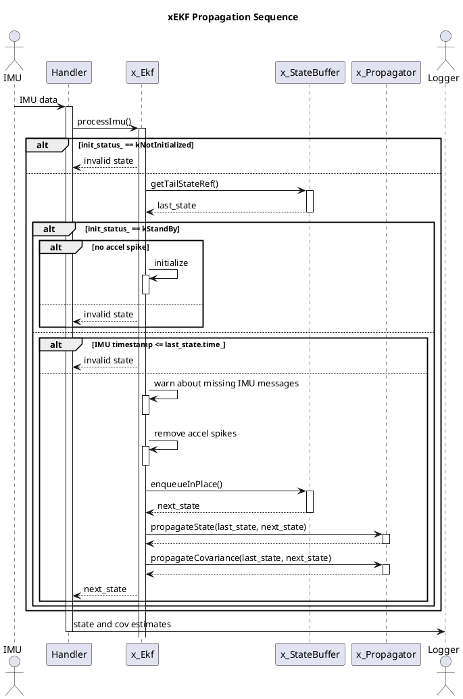

```plantuml
@startuml

title xEKF Propagation Sequence

actor IMU
participant Handler
participant x_Ekf
participant x_StateBuffer
participant x_Propagator
actor Logger

IMU->Handler++: IMU data
Handler->x_Ekf++: processImu()

alt init_status_ == kNotInitialized

  Handler<--x_Ekf: invalid state

else

  x_Ekf->x_StateBuffer++: getTailStateRef()
  x_Ekf<--x_StateBuffer--: last_state

  alt init_status_ == kStandBy
    
    alt no accel spike
      x_Ekf->x_Ekf++: initialize
      deactivate x_Ekf
    else
      Handler<--x_Ekf: invalid state
    end

  else

    alt IMU timestamp <= last_state.time_
      Handler<--x_Ekf: invalid state
    else
      
      x_Ekf->x_Ekf++: warn about missing IMU messages
      deactivate x_Ekf

      x_Ekf->x_Ekf++: remove accel spikes
      deactivate x_Ekf

      x_Ekf->x_StateBuffer++: enqueueInPlace()
      x_Ekf<--x_StateBuffer--: next_state

      x_Ekf->x_Propagator++: propagateState(last_state, next_state)
      x_Ekf<--x_Propagator--

      x_Ekf->x_Propagator++: propagateCovariance(last_state, next_state)
      x_Ekf<--x_Propagator--

      Handler<--x_Ekf: next_state
    end

  end

end

Handler->Logger: state and cov estimates

deactivate Handler

@enduml
```
