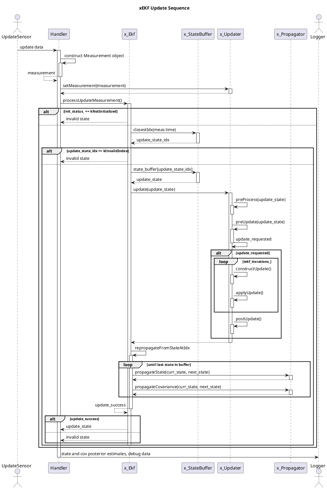

```plantuml
@startuml

title xEKF Update Sequence

actor UpdateSensor
participant Handler
participant x_Ekf
participant x_StateBuffer
participant x_Updater
participant x_Propagator
actor Logger

UpdateSensor->Handler++: update data

Handler->Handler++: construct Measurement object
Handler<--Handler--: measurement

Handler->x_Updater++: setMeasurement(measurement)
Handler<--x_Updater--

Handler->x_Ekf++: processUpdateMeasurement()

alt init_status_ == kNotInitialized

  Handler<--x_Ekf: invalid state

else

  x_Ekf->x_StateBuffer++: closestIdx(meas time)
  x_Ekf<--x_StateBuffer--: update_state_idx 

  alt update_state_idx == kInvalidIndex

    Handler<--x_Ekf: invalid state
  
  else

    x_Ekf->x_StateBuffer++: state_buffer[update_state_idx]
    x_Ekf<--x_StateBuffer--: update_state

    x_Ekf->x_Updater++: update(update_state)

      x_Updater->x_Updater++: preProcess(update_state)
      deactivate x_Updater

      x_Updater->x_Updater++: preUpdate(update_state)
      x_Updater->x_Updater--: update_requested

      alt update_requested

        loop iekf_iterations_
          x_Updater->x_Updater++: constructUpdate()
          deactivate x_Updater

          x_Updater->x_Updater++: applyUpdate()
          deactivate x_Updater
        end

        x_Updater->x_Updater++: postUpdate()
        deactivate x_Updater

      end

    x_Ekf<--x_Updater--

    x_Ekf->x_Ekf++: repropagateFromStateAtIdx

    loop until last state in buffer
      
      x_Ekf->x_Propagator++: propagateState(curr_state, next_state)
      x_Ekf<--x_Propagator--

      x_Ekf->x_Propagator++: propagateCovariance(curr_state, next_state)
      x_Ekf<--x_Propagator--

    end

    x_Ekf<--x_Ekf--: update_success

    alt update_success
      Handler<--x_Ekf: update_state
    else
      Handler<--x_Ekf: invalid state
    end

    deactivate x_Ekf

  end
end

Handler->Logger--: state and cov posterior estimates, debug data

@enduml
```
