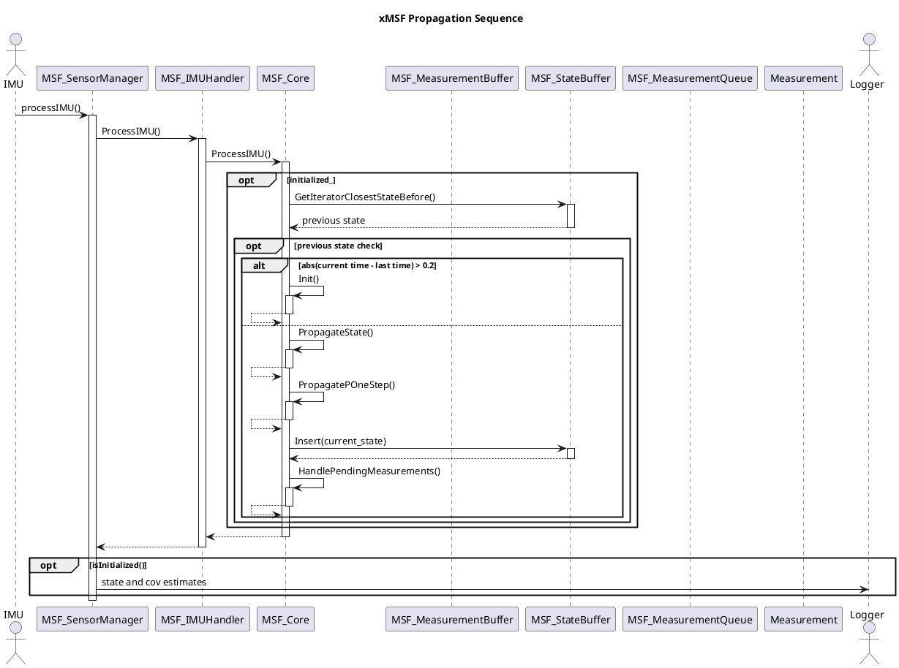

```plantuml
@startuml

title xMSF Propagation Sequence

actor IMU
participant MSF_SensorManager
participant MSF_IMUHandler
participant MSF_Core
participant MSF_MeasurementBuffer
participant MSF_StateBuffer
participant MSF_MeasurementQueue
participant Measurement
actor Logger

IMU->MSF_SensorManager++: processIMU()
MSF_SensorManager->MSF_IMUHandler++: ProcessIMU()
MSF_IMUHandler->MSF_Core++: ProcessIMU()

opt initialized_
  
  MSF_Core->MSF_StateBuffer++: GetIteratorClosestStateBefore()
  MSF_Core<--MSF_StateBuffer--: previous state

  opt previous state check
    alt abs(current time - last time) > 0.2
      MSF_Core->MSF_Core++: Init()
      MSF_Core<--MSF_Core--
    else
      MSF_Core->MSF_Core++: PropagateState()
      MSF_Core<--MSF_Core--
      MSF_Core->MSF_Core++: PropagatePOneStep()
      MSF_Core<--MSF_Core--
      MSF_Core->MSF_StateBuffer++: Insert(current_state)
      MSF_Core<--MSF_StateBuffer--
      MSF_Core->MSF_Core++: HandlePendingMeasurements()
      MSF_Core<--MSF_Core--
    end
    
  end

end

MSF_IMUHandler<--MSF_Core--
MSF_SensorManager<--MSF_IMUHandler--

opt isInitialized()
  MSF_SensorManager->Logger: state and cov estimates
end

deactivate MSF_SensorManager

@enduml
```
