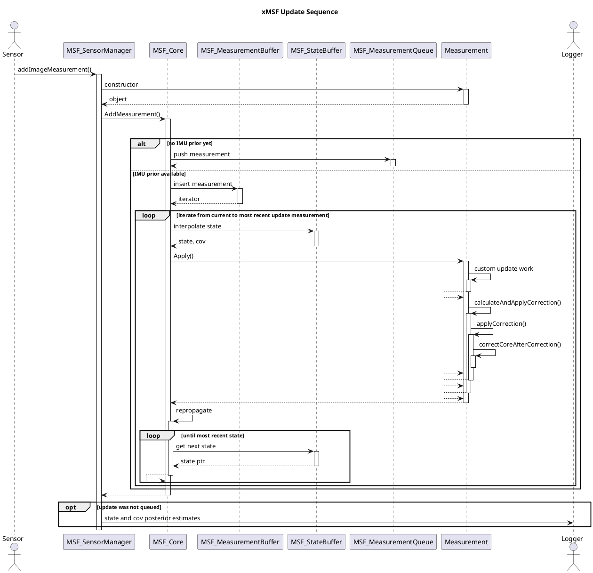

```plantuml
@startuml

title xMSF Update Sequence

actor Sensor
participant MSF_SensorManager
participant MSF_Core
participant MSF_MeasurementBuffer
participant MSF_StateBuffer
participant MSF_MeasurementQueue
participant Measurement
actor Logger

Sensor->MSF_SensorManager++: addImageMeasurement()
MSF_SensorManager->Measurement++: constructor
MSF_SensorManager<--Measurement--: object
MSF_SensorManager->MSF_Core++:  AddMeasurement()

opt update checks

  alt no IMU prior yet
    
    MSF_Core->MSF_MeasurementQueue++: push measurement
    MSF_Core<--MSF_MeasurementQueue--
  
  else IMU prior available
    
    MSF_Core->MSF_MeasurementBuffer++: insert measurement 
    MSF_Core<--MSF_MeasurementBuffer--: iterator

    loop iterate from current to most recent update measurement

      MSF_Core->MSF_StateBuffer++: interpolate state
      MSF_Core<--MSF_StateBuffer--: state, cov 

      MSF_Core->Measurement++: Apply()
      Measurement->Measurement++: custom update work
      Measurement<--Measurement--
      Measurement->Measurement++: calculateAndApplyCorrection()
      Measurement->Measurement++: applyCorrection()
      Measurement->Measurement++: correctCoreAfterCorrection()
      Measurement<--Measurement--
      Measurement<--Measurement--
      Measurement<--Measurement--
      MSF_Core<--Measurement--

      MSF_Core->MSF_Core++: repropagate

      loop until most recent state
        MSF_Core->MSF_StateBuffer++: get next state
        MSF_Core<--MSF_StateBuffer--: state ptr
      MSF_Core<--MSF_Core--
    end
    

  end

end

MSF_SensorManager<--MSF_Core--

opt update was not queued
  MSF_SensorManager->Logger: state and cov posterior estimates
end

deactivate MSF_SensorManager

@enduml
```
