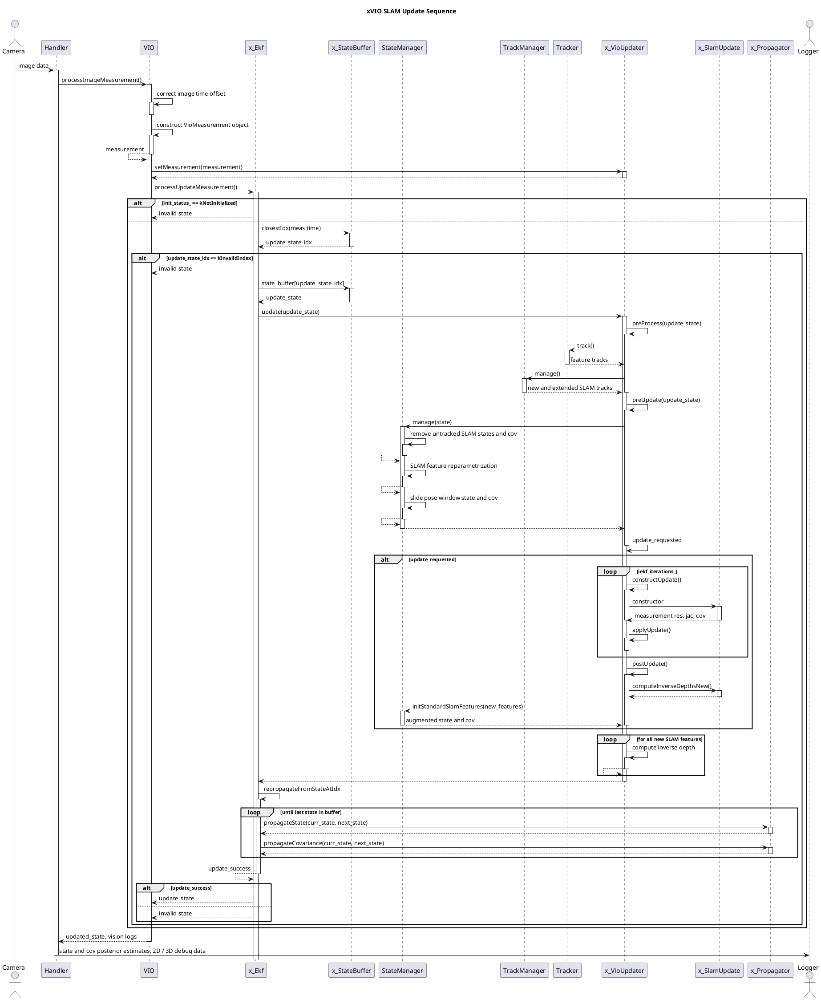

```plantuml
@startuml

title xVIO SLAM Update Sequence

actor Camera
participant Handler
participant VIO
participant x_Ekf
participant x_StateBuffer
participant StateManager
participant TrackManager
participant Tracker
participant x_VioUpdater
participant x_SlamUpdate
participant x_Propagator
actor Logger

Camera->Handler++: image data
Handler->VIO++: processImageMeasurement()

VIO->VIO++: correct image time offset
deactivate VIO

VIO->VIO++: construct VioMeasurement object
VIO<--VIO--: measurement

VIO->x_VioUpdater++: setMeasurement(measurement)
VIO<--x_VioUpdater--

VIO->x_Ekf++: processUpdateMeasurement()

alt init_status_ == kNotInitialized

  VIO<--x_Ekf: invalid state

else

  x_Ekf->x_StateBuffer++: closestIdx(meas time)
  x_Ekf<--x_StateBuffer--: update_state_idx 

  alt update_state_idx == kInvalidIndex

    VIO<--x_Ekf: invalid state
  
  else

    x_Ekf->x_StateBuffer++: state_buffer[update_state_idx]
    x_Ekf<--x_StateBuffer--: update_state

    x_Ekf->x_VioUpdater++: update(update_state)

      x_VioUpdater->x_VioUpdater++: preProcess(update_state)
        
        x_VioUpdater->Tracker++: track()
        x_VioUpdater<--Tracker--: feature tracks
      
        x_VioUpdater->TrackManager++: manage()
        x_VioUpdater<--TrackManager--: new and extended SLAM tracks

      deactivate x_VioUpdater

      x_VioUpdater->x_VioUpdater++: preUpdate(update_state)
      
        x_VioUpdater->StateManager++: manage(state)
      
          StateManager->StateManager++: remove untracked SLAM states and cov
          StateManager<--StateManager--
      
          StateManager->StateManager++: SLAM feature reparametrization
          StateManager<--StateManager--
      
          StateManager->StateManager++: slide pose window state and cov
          StateManager<--StateManager--
      
        x_VioUpdater<--StateManager--:
      
      x_VioUpdater->x_VioUpdater--: update_requested

      alt update_requested

        loop iekf_iterations_
          x_VioUpdater->x_VioUpdater++: constructUpdate()

            x_VioUpdater->x_SlamUpdate++: constructor
            x_VioUpdater<--x_SlamUpdate--: measurement res, jac, cov

          deactivate x_VioUpdater

          x_VioUpdater->x_VioUpdater++: applyUpdate()
          deactivate x_VioUpdater
        end

        x_VioUpdater->x_VioUpdater++: postUpdate()

          x_VioUpdater->x_SlamUpdate++: computeInverseDepthsNew()
          x_VioUpdater<--x_SlamUpdate--
          
          x_VioUpdater->StateManager++: initStandardSlamFeatures(new_features)
          x_VioUpdater<--StateManager--: augmented state and cov

        deactivate x_VioUpdater

      end

        loop for all new SLAM features
          
          x_VioUpdater->x_VioUpdater++: compute inverse depth
          x_VioUpdater<--x_VioUpdater--
          
        end
        
          
    x_Ekf<--x_VioUpdater--

    x_Ekf->x_Ekf++: repropagateFromStateAtIdx

    loop until last state in buffer
      
      x_Ekf->x_Propagator++: propagateState(curr_state, next_state)
      x_Ekf<--x_Propagator--

      x_Ekf->x_Propagator++: propagateCovariance(curr_state, next_state)
      x_Ekf<--x_Propagator--

    end

    x_Ekf<--x_Ekf--: update_success

    alt update_success
      VIO<--x_Ekf: update_state
    else
      VIO<--x_Ekf: invalid state
    end

  end
end

Handler<--VIO--: updated_state, vision logs

Handler->Logger--: state and cov posterior estimates, 2D / 3D debug data

@enduml
```
