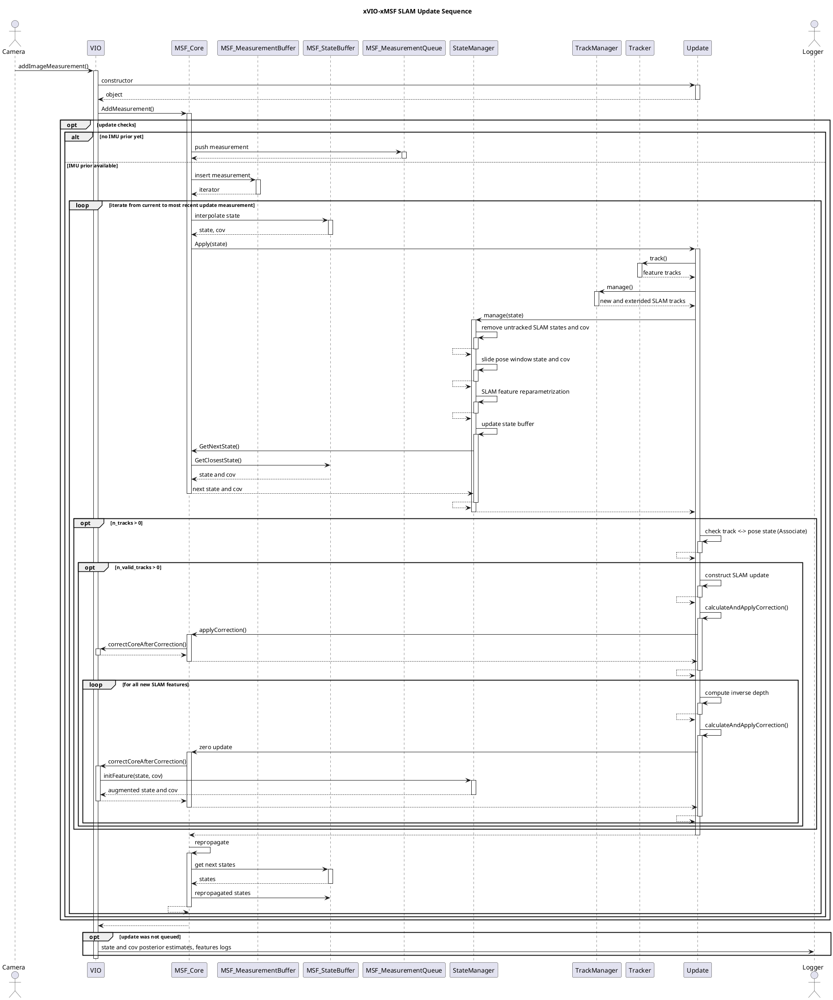

```plantuml
@startuml

title xVIO-xMSF SLAM Update Sequence

actor Camera
participant VIO
participant MSF_Core
participant MSF_MeasurementBuffer
participant MSF_StateBuffer
participant MSF_MeasurementQueue
participant StateManager
participant TrackManager
participant Tracker
participant Update
actor Logger

Camera->VIO++: addImageMeasurement()
VIO->Update++: constructor
VIO<--Update--: object
VIO->MSF_Core++:  AddMeasurement()

opt update checks

  alt no IMU prior yet
    
    MSF_Core->MSF_MeasurementQueue++: push measurement
    MSF_Core<--MSF_MeasurementQueue--
  
  else IMU prior available
    
    MSF_Core->MSF_MeasurementBuffer++: insert measurement 
    MSF_Core<--MSF_MeasurementBuffer--: iterator

    loop iterate from current to most recent update measurement

      MSF_Core->MSF_StateBuffer++: interpolate state
      MSF_Core<--MSF_StateBuffer--: state, cov 

      MSF_Core->Update++: Apply(state)
        Update->Tracker++: track()
        Update<--Tracker--: feature tracks
        Update->TrackManager++: manage()
        Update<--TrackManager--: new and extended SLAM tracks
        Update->StateManager++: manage(state)
          StateManager->StateManager++: remove untracked SLAM states and cov
          StateManager<--StateManager--
          StateManager->StateManager++: slide pose window state and cov
          StateManager<--StateManager--
          StateManager->StateManager++: SLAM feature reparametrization
          StateManager<--StateManager--
          StateManager->StateManager++: update state buffer
          StateManager->MSF_Core: GetNextState()
          MSF_Core->MSF_StateBuffer: GetClosestState()
          MSF_Core<--MSF_StateBuffer: state and cov
          StateManager<--MSF_Core--: next state and cov
          StateManager<--StateManager--
        Update<--StateManager--:
        
        opt n_tracks > 0
          
          Update->Update++: check track <-> pose state (Associate)
          Update<--Update--

          opt n_valid_tracks > 0

            Update->Update++: construct SLAM update
            Update<--Update--
            Update->Update++: calculateAndApplyCorrection()
            Update->MSF_Core++: applyCorrection()
            MSF_Core->VIO++: correctCoreAfterCorrection()
            MSF_Core<--VIO--
            Update<--MSF_Core--
            Update<--Update--
        
            loop for all new SLAM features
              
              Update->Update++: compute inverse depth
              Update<--Update--
              Update->Update++: calculateAndApplyCorrection()
              Update->MSF_Core++: zero update
              MSF_Core->VIO++: correctCoreAfterCorrection()
              VIO->StateManager++: initFeature(state, cov)
              VIO<--StateManager--: augmented state and cov
              MSF_Core<--VIO--
              Update<--MSF_Core--
              Update<--Update--

            end
          end

        end

      MSF_Core<--Update--

      MSF_Core->MSF_Core++: repropagate
      MSF_Core->MSF_StateBuffer++: get next states
      MSF_Core<--MSF_StateBuffer--: states
      MSF_Core->MSF_StateBuffer: repropagated states
      MSF_Core<--MSF_Core--
    end
    

  end

end

VIO<--MSF_Core--

opt update was not queued
  VIO->Logger: state and cov posterior estimates, features logs
end

deactivate VIO

@enduml
```
